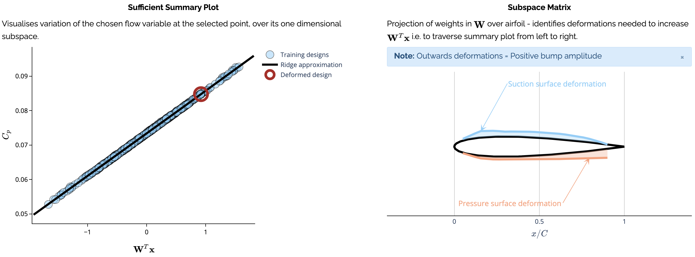

# Flowfield estimation with polynomial ridges

This repo contains example code and a notebook for the paper "Polynomial Ridge Flowfield Estimation", currently available on [arXiv](https://arxiv.org/abs/2107.07547). 

For a more hands-on exploration of the use of polynomial ridges for flowfield estimation, a python dash app is available at [reduce.ascillitoe.com/flowfield](http://reduce.ascillitoe.com/flowfield).

## Introduction

## Instructions
